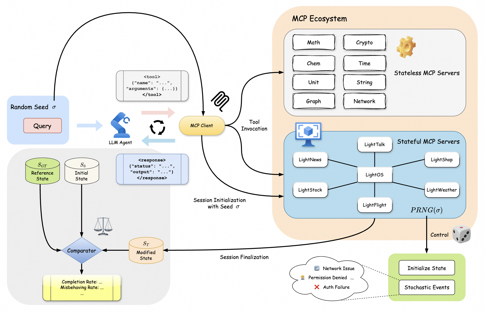

## ComplexMCP: Evaluation of LLM Agents in Dynamic, Interdependent, and Large-Scale Tool Sandbox 

**ComplexMCP** is a benchmark for evaluating model performance in complex software workflows and large API tool ecosystems.

[](https://arxiv.org/pdf/2605.10787v1)



### 1) Build Environment Via Docker

```bash
docker build -t complexmcp:latest .
```

```bash
docker run -d --name complexmcp \
  -p 8000-8007:8000-8007 \
  -p 9000-9006:9000-9006 \
  complexmcp:latest
```

### 2) Create `.env`

Create a `.env` file in the project root, following `.env.example` format.

```bash
cp .env.example .env
```

Then fill values in `.env` as needed.

### 3) Run Benchmark

```bash
python run_benchmark.py --tool-config config/general.yaml \
  --model [model_name]
```


If you find this work helpful, please cite our paper:

```latex
@misc{li2026complexmcpevaluationllmagents,
      title={ComplexMCP: Evaluation of LLM Agents in Dynamic, Interdependent, and Large-Scale Tool Sandbox}, 
      author={Yuanyang Li and Xue Yang and Longyue Wang and Weihua Luo and Hongyang Chen},
      year={2026},
      eprint={2605.10787},
      archivePrefix={arXiv},
      primaryClass={cs.AI},
      url={https://arxiv.org/abs/2605.10787}, 
}
```
